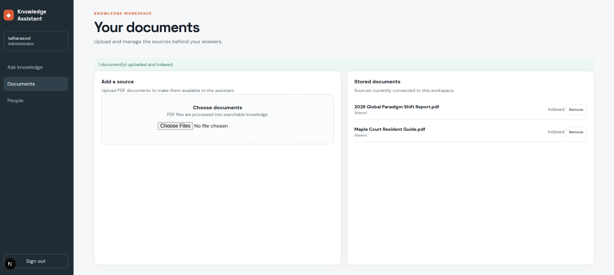
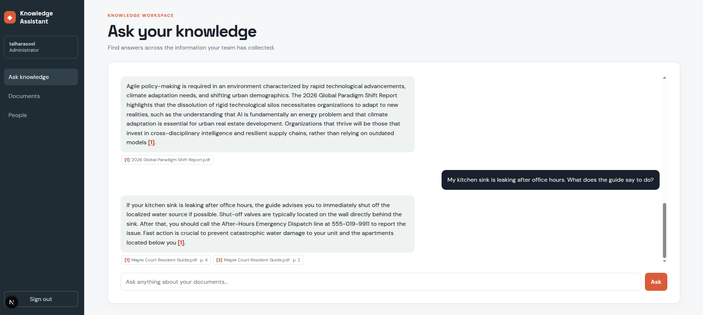
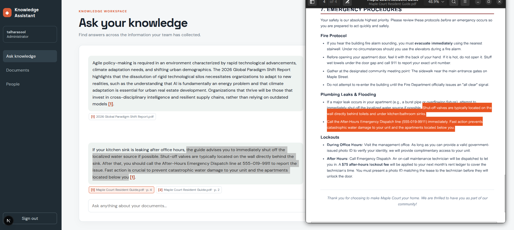
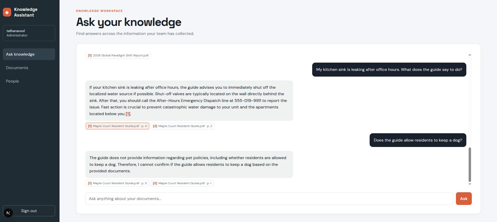

# Knowledge Assistant

Knowledge Assistant is a document-grounded chat application. The current backend supports PDF upload, ingestion, vector search, and chat over uploaded documents. Images, web pages, URLs, and audio are future extensions, not currently implemented ingestion sources.

Users can upload PDF documents and ask natural-language questions to retrieve relevant content and generate RAG-powered answers.

The platform provides separate experiences for regular users and administrators. Users can add and explore knowledge, while administrators can manage users, shared content, access, and system activity.

## Screenshots

The screenshots below show the PDF workflow using the fictional Maple Court Resident Guide demo document.

### Indexed Documents

PDFs are listed with their indexing status after upload.



### Cited Answer

An after-hours leak question answered from the guide, with the source filename and page citation visible.



### Citation Verification

The cited answer is shown alongside the matching source page for manual verification.



### Missing Information

When asked about a pet policy that is not covered in the guide, the assistant says it cannot confirm the answer from the available documents.



## What It Does

- **Manage PDF knowledge**: Upload, ingest, list, and remove PDFs.
- **Search by meaning**: Store document chunks and embeddings in PostgreSQL with pgvector.
- **Ask grounded questions**: Retrieve relevant PDF content and use it as context for chat responses.
- **Separate private and shared content**: Apply user/public metadata to document retrieval.
- **Manage users and chat history**: Provide separate user and administrator API operations.

## Who It Is For

Knowledge Assistant is useful for teams and individuals who need question answering over PDF collections, including research and internal document assistance.

## How It Works

1. Upload a PDF through the API or frontend.
2. Ingest it to extract text, split it into chunks, and create embeddings.
3. Ask a question in natural language.
4. The backend retrieves relevant chunks and passes them to the configured chat model.

## Project Areas

```
.
├── backend/
│   ├── README.md
│   └── ... (application services and knowledge processing)
│
├── frontend/
│   ├── README.md
│   └── ... (user and administrator workspace)
│
```

## Technical Documentation

- [Backend README](backend/README.md): Backend setup, authentication, content management, database, ingestion, retrieval, and API details.
- [Frontend README](frontend/README.md): Next.js user workspace, frontend setup, API connection, and production build details.
